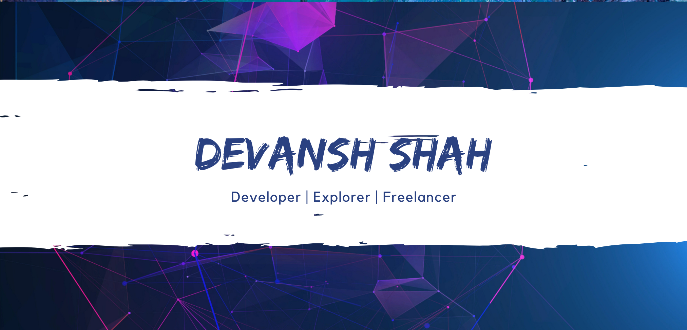

<h1> Hello stranger!  

 
</h1>

<h3>
I'm Devansh Shah
</h3>

I welcome you to witness my journey as a coding entusiast who has set out to sail in ever growing tech world.

Always seeking out opportunities to <b>develop</b> challenging applications, <b>collaborate</b> with like minded intellectuals and sharing these skillsets to give back to the community.

Connect with me : 

